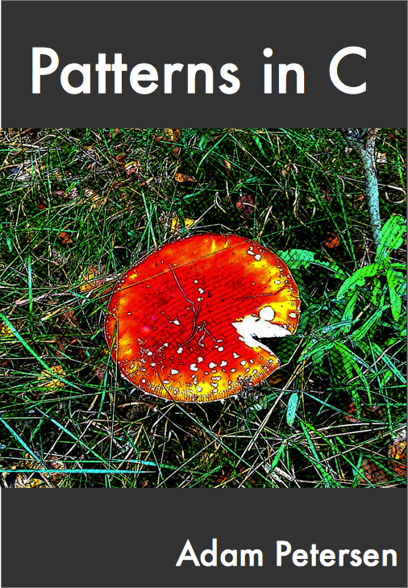

# Patterns in C

This repository contains the code samples from my book [Patterns in C](https://leanpub.com/patternsinc).

.

Please note that the code samples are just fragments and not intended to stand on their own. They're intended to accompany the chapters in the [book](https://leanpub.com/patternsinc). Some variations and alternative implementations have been left out.
